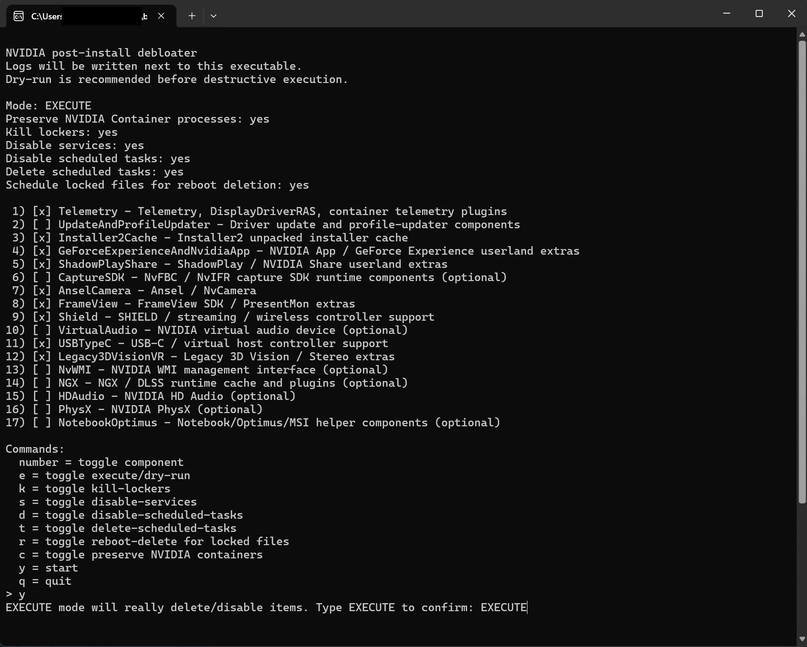

# Rusty Butter Knife



**WARNING: THIS SOFTWARE IS PROVIDED "AS IS", WITHOUT WARRANTY OF ANY KIND.**

You use this tool entirely at your own risk. It deletes files, modifies Windows
services, disables scheduled tasks, and schedules reboot-time deletion of locked
files. Misuse or bugs **can** damage your NVIDIA driver installation, break GPU
acceleration, cause display issues, or otherwise mess up your system.

- The author has **not** tested this on a wide range of systems.
- There is **no** undo. If something breaks, you may need to reinstall the
  NVIDIA driver or, in the worst case, restore from backup.
- **Always** run `--dry-run` first and review the log before running with
  `--execute`.

---

## What it does

Scans common NVIDIA installation paths (`Program Files`, `ProgramData`,
`DriverStore/FileRepository`, `%APPDATA%`, etc.) for known bloat components and
optionally removes them. The list includes:

- Telemetry DLLs and plugins
- GeForce Experience / NVIDIA App userland files
- ShadowPlay / Share components
- Ansel / NvCamera
- FrameView SDK / PresentMon
- SHIELD / streaming support
- NVIDIA virtual audio device (NvVAD)
- USB-C / virtual host controller support (NvvHCI)
- Legacy 3D Vision / Stereo extras
- NGX / DLSS runtime cache
- HD Audio driver extras (nvhda)
- PhysX SDK
- Notebook / Optimus helpers
- Installer2 unpacked installer cache

By default, NGX, HDAudio, PhysX, NotebookOptimus, VirtualAudio, NvWMI and
CaptureSDK are **not** enabled (use their `--include-*` flags to activate).

---

## Build

```powershell
python build.py
```

or directly using Cargo:

```powershell
cargo build --release
```

Builds `RustyButterKnife.exe` using Rust with the MSVC toolchain
([rustup](https://rustup.rs), `x86_64-pc-windows-msvc`). `build.py` always
passes the requested target triple explicitly, including x86_64 builds made on
ARM64 Windows hosts. Every produced binary's PE machine type is verified
against the requested architecture before it lands in `dist/`. The build also
injects compiler path remapping so host usernames and local workspace paths are
never baked into release binaries.

Options:

| Option | Description |
|--------|-------------|
| `--arch aarch64` | Cross-compile for Windows-on-ARM64 into `dist/<arch>/`. Requires the matching rustup target (`aarch64-pc-windows-msvc`). |
| `--clean` | Remove `target/` and `dist/`. |

The repository includes a Windows GitHub Actions gate that runs build, clippy,
unit/integration tests, and safe CLI smoke commands on pushes and pull requests.
Existing source is not guaranteed whole-tree rustfmt-clean, so verification
intentionally avoids unrelated formatter churn. Marked release commits on
`main` additionally build the verified x86_64 artifact and publish the GitHub
release.

---

## Usage

### 1. Interactive menu (default)

```
RustyButterKnife.exe
```

A bare launch (e.g. double-click in Explorer) opens the wizard with the
recommended cleanup pre-selected:

- `--execute` (destructive mode)
- `--kill-lockers`
- `--disable-services`
- `--delete-scheduled-tasks`
- `--schedule-reboot-delete`

The `UpdateAndProfileUpdater` component is **deselected** by default, so the
NVIDIA driver-update/profile-updater stack is kept. Everything remains
toggleable; nothing runs until you press `y` and type `EXECUTE` to confirm.
If the session is not elevated, the tool then relaunches itself elevated via a
UAC prompt with the confirmed selection; the elevated window stays open at the
end so results remain visible.

Starting destructive EXECUTE mode from an explicit `--menu` run also requires
typing `EXECUTE` as a confirmation (`--menu` itself starts with inert dry-run
defaults). Component selections and effective switches are always forwarded to
the elevated TrustedInstaller child.

### 2. Dry-run (safe, does nothing)

```
RustyButterKnife.exe --dry-run
```

### 3. Full cleanup

Run as Administrator:

```
RustyButterKnife.exe --execute --kill-lockers --disable-services --delete-scheduled-tasks --schedule-reboot-delete
```

This will attempt a TrustedInstaller-level relaunch via the Task Scheduler COM
API so that it can delete files a normal Administrator cannot touch. If the
system does not grant TrustedInstaller (Windows limitation), the tool falls back
to SYSTEM privileges, which are still sufficient for the vast majority of files.
The parent waits for the SYSTEM worker task and reads its exit code via the Task
Scheduler (`LastTaskResult`); failures propagate via exit codes 10 and 11.

---

## Flags

| Flag | Description |
|------|-------------|
| `--execute` | Actually delete/disable. Default is dry-run. |
| `--dry-run` | Explicit dry-run. |
| `--menu` | Interactive component selection. |
| `--no-menu` | Suppress the interactive menu. |
| `--kill-lockers` | Stop bloat processes before deleting. |
| `--preserve-nvcontainers[=on/off]` | Also kill NVDisplay.Container/nvcontainer if set to off. Default preserves them. |
| `--disable-services` | Disable matched NVIDIA bloat services. |
| `--delete-services` | Delete matching NVIDIA bloat services. |
| `--disable-scheduled-tasks` | Disable matched NVIDIA scheduled tasks (default on). |
| `--no-disable-scheduled-tasks` | Do not disable matched scheduled tasks. |
| `--delete-scheduled-tasks` | Delete matched NVIDIA scheduled tasks. |
| `--schedule-reboot-delete` | Use MoveFileEx for locked files. |
| `--take-ownership` | Run takeown/icacls before deletion (locale-safe: grants via well-known SID). |
| `--include-ngx` | Include NGX/DLSS runtime cache cleanup. |
| `--include-hdaudio` | Include NVIDIA HD Audio cleanup. |
| `--include-physx` | Include PhysX SDK cleanup. |
| `--include-notebook-optimus` | Include notebook/Optimus helper cleanup. |
| `--include-virtual-audio` | Include NvVAD virtual audio device cleanup. |
| `--include-nvwmi` | Include NVIDIA WMI management interface cleanup. |
| `--include-capture-sdk` | Include NvFBC/NvIFR capture SDK runtime cleanup. |
| `--component=Key:on/off` | Toggle a specific component (repeatable, e.g. `--component=NGX:on`). Unknown keys or malformed values are listed with the valid keys; execute mode rejects them before any change (exit code 13), dry runs only warn. |
| `--list-components` | Print all component keys and their state, then exit. |
| `--no-ti-relaunch` | Do not attempt TrustedInstaller scheduled-task relaunch. |
| `--allow-admin-fallback` | Permit destructive execution as Administrator. |
| `--ti-wait-seconds N` | Parent wait timeout for TI child (default 600, clamped to 15–7200 seconds; the entire value must be an integer; `=N` form also accepted). |
| `--status-file PATH` | Write final run status JSON to PATH. The request is preserved through UAC/TI handoffs. |
| `--log-dir PATH` | Base directory for the log file (default: beside the executable). |
| `--log-file PATH` | Use exactly this log file; all processes of a run append to it, so one run leaves one log. |
| `--no-pause` | Do not pause on exit. |
| `--pause` | Always pause on exit (used by the elevated instance spawned by a bare double-click launch). |
| `--no-color` | Monochrome console output. |
| `--version` | Print version and exit. |
| `--help`, `-h`, `/?` | Show help. |

---

## Exit codes

| Code | Meaning |
|------|---------|
| 0 | Success (including successful TI-child run). |
| 1 | Fatal exception. |
| 2 | Unknown fatal exception. |
| 3 | Run aborted by user (Ctrl+C); partial results recorded. |
| 10 | TrustedInstaller relaunch failed or was not permitted. |
| 11 | Elevated TI child reported failure. |
| 12 | Another execute-mode instance is already running, or the single-instance mutex could not be created (destructive runs are refused rather than left unserialized). |
| 13 | Invalid or unknown argument rejected before any change (execute mode is strict; dry runs only warn). |

---

## Safety notes

- Every mutation target - files, processes, services AND scheduled tasks - is
  classified against your component selection first; a deselected component
  prevents ALL of its associated actions, and unclassifiable targets fail
  closed (never mutated).
- Process termination is additionally restricted to an explicit executable
  allowlist. The process is opened first and its live full image path is
  verified through the **same handle** used for termination; a matching
  basename outside an NVIDIA installation path is skipped, and PID reuse
  between enumeration and termination cannot redirect the action.
- Service and task mutations require a strong NVIDIA anchor (`NVIDIA`,
  `GeForce`, or known NVIDIA `Nv...` prefixes) before semantic terms such as
  `update`, `share`, or `broadcast` are considered. Generic `Nv...` names from
  unrelated software therefore fail closed.
- Recursive operations never traverse reparse points (symlinks/junctions);
  such entries may be removed themselves but their targets are untouched.
- External-tool output capture is hard-bounded: timeouts terminate the child
  promptly even when descendants inherited stdout, waits honor Ctrl+C, and
  cross-builds cannot publish an exe with the wrong PE architecture.
- A run aborts (FATAL) before any destructive stage if its audit log cannot
  be written; large report sections are serialized across processes so they
  cannot interleave in the shared log.
- Malformed or unknown arguments in execute mode are rejected before any
  change (exit code 13); dry runs only warn.
- Destructive runs hold a single-instance mutex; overlapping execute-mode runs
  are refused with exit code 12.
- System tools (`schtasks.exe`, `takeown.exe`, `icacls.exe`) are always invoked
  by absolute path from `%SystemRoot%\System32` — never through the PATH search,
  which would allow CWD/app-dir planting in an elevated context.
- Ctrl+C / closing the console triggers cancellation. For a UAC handoff, the
  launcher relays the request to the elevated process through a named Windows
  event and remains attached until that process actually exits; it never
  reports "aborted" while an elevated destructive child is still running.
- Scheduled-task names are decoded from the OEM code page, so non-ASCII task
  names survive matching and `/TN` operations on localized systems.
- DriverStore package roots are recognized for both `.inf_amd64_` (x64) and
  `.inf_arm64_` (ARM64) packages; whole-package deletion stays blocked and only
  explicitly allow-listed subfolders may be removed recursively. Note that
  individual files *inside* DriverStore packages can still be deleted when a
  file name matches an enabled component; this is intended component payload
  removal but means an opt-in component can touch files inside a driver package.
- Read-only files/directories get their attributes cleared and are retried once;
  deep paths fall back to extended-length (`\\?\`) forms before being scheduled
  for reboot-time deletion.
- Stale artifacts of crashed previous runs (`NvDebloatTI-*-status.json`,
  orphaned scheduled tasks) are swept automatically at relaunch time.
- The elevated task is registered with a 2-hour execution time limit so a
  runaway child cannot linger for days.
- Built binaries employ compiler path remapping (`--remap-path-prefix`) so
  build environments and host usernames are never leaked in released binaries.

---

## Logs & reports

A full run — including the unelevated launcher, the elevated UAC instance and
the SYSTEM worker, plus the candidate list and a JSON report block — is written
to **one single log file** next to the executable:

- `debloat-YYYYMMDD-HHMMSS.log` — everything: progress, actions, candidates, a
  **post-run existence check** (lists any bloat paths that still exist after
  the run, with the reason — dry-run, pending reboot deletion or failure; 0
  remaining = fully cleaned) and the final JSON report. All processes of a run
  append to this same file (`--log-file PATH` overrides the location;
  `--log-dir PATH` changes the base directory).

No status JSON, CSV or separate report files are created by default. Supplying
`--status-file PATH` explicitly adds the final machine-readable status JSON;
the normal unified run log remains unchanged.

---

## License

MIT License

Copyright (c) 2026 aufkrawall

Permission is hereby granted, free of charge, to any person obtaining a copy
of this software and associated documentation files (the "Software"), to deal
in the Software without restriction, including without limitation the rights
to use, copy, modify, merge, publish, distribute, sublicense, and/or sell
copies of the Software, and to permit persons to whom the Software is
furnished to do so, subject to the following conditions:

The above copyright notice and this permission notice shall be included in all
copies or substantial portions of the Software.

THE SOFTWARE IS PROVIDED "AS IS", WITHOUT WARRANTY OF ANY KIND, EXPRESS OR
IMPLIED, INCLUDING BUT NOT LIMITED TO THE WARRANTIES OF MERCHANTABILITY,
FITNESS FOR A PARTICULAR PURPOSE AND NONINFRINGEMENT. IN NO EVENT SHALL THE
AUTHORS OR COPYRIGHT HOLDERS BE LIABLE FOR ANY CLAIM, DAMAGES OR OTHER
LIABILITY, WHETHER IN AN ACTION OF CONTRACT, TORT OR OTHERWISE, ARISING FROM,
OUT OF OR IN CONNECTION WITH THE SOFTWARE OR THE USE OR OTHER DEALINGS IN THE
SOFTWARE.
